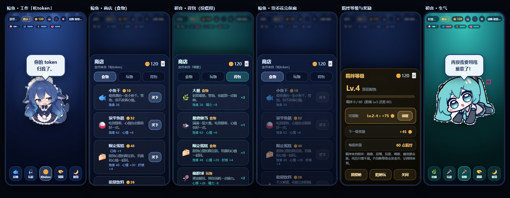
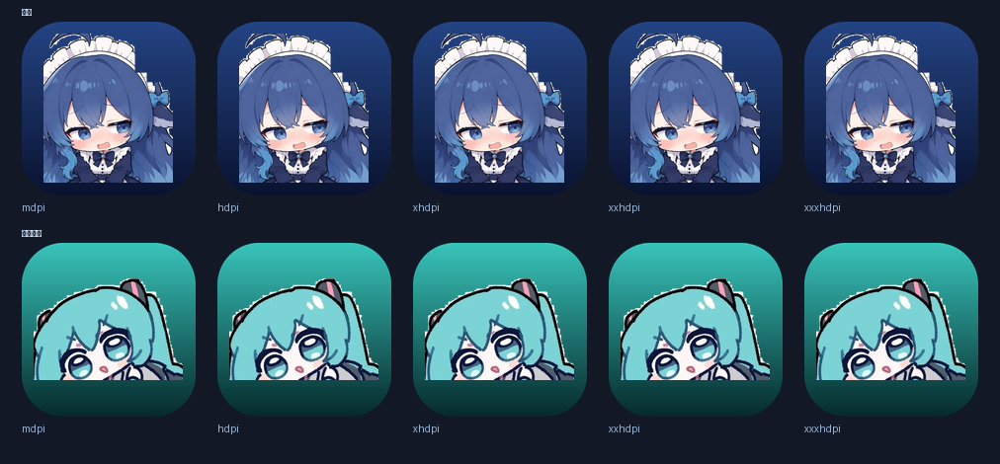

# 邪恶鲸鱼 / 初音未来

一个赖在你手机上的安卓宠物，要打工赚钱养她。
第一位是那只著名的懒鲸鱼女仆，她最伟大的成就是：把你的交付目录一起删了。
第二位是初音未来，随时可以切换。

| | |
|---|---|
| 应用名 | 邪恶鲸鱼 |
| 包名 | `com.evilwhale.pet` |
| 版本 | 2.0 (versionCode 6) |
| 安装包 | `dist/EvilWhale-2.0.apk` (2.94 MB) |
| 最低版本 | Android 5.0 (API 21) |
| 目标版本 | Android 15 (API 35) |
| 签名 | v1 + v2，调试自签名（`keystore/evilwhale.jks`） |

---

## 一、核心循环

```
   打工赚金币  ──→  商店买东西  ──→  背包囤起来  ──→  投喂 / 玩耍
        ↑                                                    │
        └────────── 需求够了才值得继续打工 ──────────────────┘
              （钱包和背包都空时，还有免费保底兜着）
```

金币只能靠打工赚，食物和玩物只能在商店买，喂食和玩耍都不白送东西。

| 角色 | 工作 | 金币 / 次 | 消耗 | 收益 |
|---|---|---|---|---|
| 邪恶鲸鱼 | 吃token 🪙 | 9 | 无 | 饱食 −22、心情 +6、好感 +4 |
| 初音未来 | 唱歌 🎤 | 26 | 精力 −20、饱食 +8 | 心情 +14、羁绊 +2、好感 +5 |

几点设计考虑：

- 鲸鱼的工作就是吃 token，打工等于进食，"饿了→打工→吃饱"本身就是循环，
  也符合她删你目录的人设。
- 初音唱歌赚得多但费精力，精力见底就唱不动，得先睡觉。所以两个角色节奏
  完全不同：鲸鱼越饿越该打工，初音唱完必须休息。
- 连续打工每次 +6 满足度、收益 +1.2 金币，闲下来会慢慢消退，
  所以攒一会儿再打比连点划算。
- 初音有 22% 概率触发安可（×1.8 金币）；鲸鱼有 18% 概率"一口吞了十枚"
  （×1.9 金币，额外 −10 饱食）。
- 鲸鱼饱食低于 10 时仍能打工，但只拿 40% 的钱。故意不设成"拒绝"：
  打工是唯一收入，拒绝了人会卡死。

### 商店（11 件商品）

| 类别 | 商品 | 价格 | 效果 |
|---|---|---|---|
| 食物 | 🐟 小鱼干 | 10 | 饱食 26（只有鲸鱼） |
| 食物 | 🌿 大葱 | 10 | 饱食 26（只有初音） |
| 食物 | 🍚 豪华鱼膳 / 🍱 葱烧便当 | 32 | 饱食 62、心情 +6 |
| 食物 | 🍰 限定蛋糕 | 48 | 饱食 40、心情 +20、好感 +4 |
| 食物 | 🥤 能量饮料 | 26 | 精力 +34、饱食 8 |
| 玩物 | 🎾 橡胶球 | 18 | 心情 +26、精力 −8 |
| 玩物 | 🎣 钓竿 | 40 | 心情 +40、精力 −14 |
| 玩物 | 🎫 演唱会门票 | 96 | 心情 +62、好感 +12 |
| 玩物 | 🎤 限定麦克风 | 150 | buff：10 分钟内玩耍收益 ×2 |
| 玩物 | 🍫 能量棒 | 72 | buff：10 分钟内所有需求衰减减半 |

- 食物和玩物都进背包，按主界面的「投喂」/「玩耍」使用。
- 投喂吃最好的一件，玩耍用最便宜的一件（好东西留着）。
- 带 buff 的道具会显示在状态栏下面（🎤 8′ 这种倒计时标签）。
- 角色专属商品自动过滤：切到初音，食物页就是大葱和便当。

### 不会卡死的三道保险

1. 初始 120 金币，够吃好几顿，不用先打工就能明白怎么玩。
2. 鲸鱼饿到极限也能打工（吃 token 本身就是进食），所以"没金币→买不起食物
   →不能打工赚钱"这条死锁走不通。
3. 钱包和背包同时空了，按「投喂」她会自己去弄一点吃的。

### 保底

| | 商店最便宜的食物 | 保底 |
|---|---|---|
| 花费 | 10 金币 | 免费 |
| 饱食回复 | 26 | 20 |
| 心情 | 不扣 | −3 |
| 冷却 | — | 90 秒 |

保底刻意做得比买食物差：回复更少、还扣心情，所以它是地板而不是策略，
不会有人靠保底躺着不打工。只要钱包里还够买最便宜的食物，她就不会去讨饭。
保底冷却中再按投喂，会提示还有多少秒，而不是默默没反应。

---

## 二、两个角色

右上角"切换 邪恶鲸鱼 / 切换 初音未来"按钮随时换人。
切换时立绘淡出旋转，整套配色（背景、状态条、按钮、粒子）一起过渡。
两个角色各自记着自己的金币、背包、buff 和全部数值，换回来还是原来的状态。





---

## 三、初音未来的台词

台词全部写在 `assets/pet_config.js` 里，按情绪/动作分类。语言元素取自公开的
角色设定与名曲梗（[39 = 感谢](https://moegirl.uk/index.php?title=39(VOCALOID)&oldid=1183167)、
[甩葱歌 / 大葱](https://vcpedia.cn/zh-hk/%e8%91%b1%e5%a8%98)、
[世界第一的公主殿下](https://voca.wiki/%E4%B8%96%E7%95%8C%E5%B1%9E%E4%BA%8E%E6%88%91)、
[千本樱等名曲](https://www.sohu.com/a/47692824_119038)），没有照搬受版权保护的歌词原文：

- 身份梗："我是初音未来，39（谢谢）～"、"世界第一的公主殿下，就是我哦。"
- 声音梗："我的声音是合成出来的，但心情是真的。"
- 名曲梗："唱哪一首？千本樱还是甩葱歌？"、"甩葱歌，预备——起！"
- 大葱梗："大葱！我最喜欢大葱了～"
- 打工台词："一首歌换一点金币，很划算吧？"、"唱完这首歌，我就能买大葱了。"
- 累了的台词："嗓子……有点哑了。"、"灯光师，把灯关一下吧……"

想加句子直接往 `pet_config.js` 的数组里写，不用碰任何逻辑。

---

## 四、背景音乐

用的是《蔚蓝档案》5th PV 音频（`bgm.m4a`，1.27 MB，AAC/MP4，81 秒，循环）。
进游戏自动播放，右上角 🔊 可以静音。音量压在 30%，免得盖过角色语音。

播放由原生 `MediaPlayer` 负责，切后台自动暂停、回来自动继续，
音频在 APK 内是不压缩存储的。

之所以能自动播：`MediaPlayer` 播自己 APK 里的资源不属于浏览器的 autoplay
限制范畴（那条规则管的是 WebView 里的 `<audio>`）。万一某台设备仍然拒绝，
🔊 按钮就是兜底。

---

## 五、角色语音（免费 TTS）

她说话时会出声，右上角 🗣️ 可以关。

先说清楚能还原到什么程度：初音未来的声音是 Crypton 的合成音源，
没有可以免费、离线、合法打包进 APK 的音源。所以这里的做法是
"让系统 TTS 念出来，再用软件把它改造成她的音域"：

```
系统 TTS 合成 → WAV → 自写 DSP（变调 + 合唱）→ AudioTrack 播放
```

- 变调：重叠相加（overlap-add）算法。每帧按 1/ratio 重采样把音高抬起来，
  再用固定的合成跳距把时长拉回来，变调不变速。
- 合唱/失谐：叠一层 14ms、缓慢摆动的延迟副本。这层"双声"正是 VOCALOID
  听起来像合成音而不是真人的关键。
- 两个角色的处理不同：鲸鱼降调 0.90x（偏低偏懒），初音升调 1.26x
  （她的音域高得多）。
- 选声：优先挑系统里的中文女声离线音源。不选日文音源是因为台词是中文，
  日文音源念中文会很难听，音色接近不如念得清楚重要。
  引擎装的哪种，日志里会打出来（`EvilWhaleTts` tag）。

局限：这不是初音未来的音源，升调后的中文女声听起来更像"电子化高音"
而不是她本人。想真正还原只有两条路：用她自己的音源（有版权，不能打包），
或者接在线语音合成（不免费、要联网）。当前方案是免费离线前提下能做到的
最接近的近似。

另外，不同手机的 TTS 引擎差别很大，有的机器（尤其精简 ROM）可能压根没装
中文 TTS，这时语音会静默失败，界面照常工作。

---

## 六、羁绊等级与奖励

点右上角「羁绊 N」打开面板，可以看到：

- 当前等级、距离下一级还差多少点（进度条）
- 「可领取」的等级奖励；有奖励时 HUD 上的等级按钮会发光并显示 ↑
- 下一级奖励是多少、每级需要多少点

奖励规则：升到第 N 级（N≥2）发 `15 + 10×(N−2)` 金币，
所以 Lv.2 = 15，Lv.3 = 25，Lv.4 = 35，依次递增。每级需要 60 点羁绊，
羁绊只增不减。

奖励要手动领，因为静默到账的话，玩家不会意识到"对她好是有回报的"，
回去点一下，这件事才可见。奖励不会丢：一次跨了 3 级就一次全领。
如果升级时你在别的界面，等级按钮会亮起来提示。

羁绊来自陪伴：摸摸、投喂、玩耍、唱歌、睡觉都会涨。

---

## 七、好感度与自动关闭

状态栏第四格 💗 是好感度，和心情是两套数值：

- 好感度持续下降（约每 150 秒 −4），打工、喂食、玩耍、睡觉都能回
- 低于 25 她开始抱怨；掉到 0 她会说一句告别的话，然后自己把软件关掉
- 为了让告别看得清，关闭延迟 2.6 秒才执行，不是瞬间闪退
- 离线期间好感度也会掉（半速，最多累计 8 小时）

> 调整强度：`assets/pet.js` 顶部 `FAVOR_DRAIN_SECONDS` / `FAVOR_WARN_AT` /
> `FAVOR_QUIT_DELAY_MS`；经济数值全在 `assets/pet_config.js` 的
> `SHOP_ITEMS` / `WORK` / `COINS_PER_WORK` / `WORK_COOLDOWN_MS` 里。

---

## 八、操作一览

| 操作 | 反应 |
|---|---|
| 点她一下 | 回嘴 |
| 按住拖动 | 整只跟着手指走，松手弹回 |
| 投喂 🐟 / 给葱 🌿 | 从背包吃掉最好的一份食物；背包空了自动补买最便宜的那份 |
| 玩耍 🎣 / 🎤 | 消耗背包里最便宜的玩物 |
| 吃token / 唱歌 | 打工赚钱，26 秒冷却，按钮上显示倒计时或卡在哪一项 |
| 摸摸 🫳 | 心情 + 好感 +，连摸 5 次以上炸毛 |
| 睡觉 🌙 | 精力持续回复（初音唱歌前必须先睡） |
| 点「羁绊 N」 | 打开等级面板，看进度、领奖励 |
| 🏪 / 🗣️ / 🔊 | 商店 / 角色语音开关 / 背景音乐开关 |

四种表情由数值自动切换：开心蹦跳、精力见底摇晃冒💤、
饿到不行发抖、心情太低或连续被摸则抖动冒💢。

注意喂食只补饱食，补不了精力。初音唱不动多半是精力见底，
睡觉或者能量饮料才行。

---

## 九、立绘是怎么抠出来的

两张原图都是白底，但直接"白色变透明"会毁掉角色：鲸鱼的脸、蕾丝、荷叶边，
初音的衬衫和马尾内侧都会被一起抠掉。所以走轮廓封水再漫水的办法
（`tools/make_sprites.py`，两个角色共用一条流水线，参数按各自线宽分别调）：

1. 对线稿做形态学闭运算，让角色自己的黑轮廓变成一堵不漏水的墙；
2. 从图像四边向内漫水填充"纸面"，能淹到的才是背景，被轮廓包住的
   白色部分因此全部保留；
3. 鲸鱼那张另外按位置剔除对话气泡和它的指向尾巴；
4. 侵蚀一次让汗珠、动感线这类细长杂物断开，再把结实的身体长回来；
5. 只保留最大的连通块，羽化边缘后裁剪。

产出 `whale_body.png` 824×928、`miku_body.png` 408×352。
另外每个角色按自己的宽高比决定展示盒子形状，否则初音会因为图更"扁"
而被 `object-fit` 缩得比鲸鱼小一大圈。

---

## 十、工程结构

```
evilwhale/
├── AndroidManifest.xml              清单（权限、Activity、图标）
├── build.ps1                        免 Gradle 构建脚本
├── src/com/evilwhale/pet/
│   ├── MainActivity.java            全屏 WebView 宿主 + 音乐 + 震动 + 退出桥
│   ├── TtsSpeaker.java              系统 TTS 合成 + 选声 + 台词队列
│   └── VoiceFx.java                 变调（overlap-add）+ 合唱 + AudioTrack 播放
├── assets/                          （打进 APK）
│   ├── pet.html                     界面结构（HUD / 按钮 / 商店面板）
│   ├── pet.css                      主题变量、动画、四种情绪、商店样式
│   ├── pet_config.js                ★ 角色数据 + 商品表 + 工作定义 + 台词库
│   ├── pet.js                       引擎：数值、经济、背包、buff、音乐、触摸
│   ├── bgm.m4a                      背景音乐（循环）
│   ├── whale_body.png / whale_icon.png
│   └── miku_body.png  / miku_icon.png
├── res/mipmap-*/ic_launcher.png     五档密度的圆角启动图标
├── keystore/evilwhale.jks           签名密钥
├── dist/                            成品 APK + 预览图
└── assets/preview*.html, measure.html   设计/测量用，不打进 APK
```

加第三个角色只需两步：在 `pet_config.js` 的 `CHARACTERS` 里加一条
（名字、立绘、宽高比、配色、台词），在 `CHARACTER_ORDER` 里加 id，
再在 `WORK` 里加一份工作定义，然后放两个 PNG 进 `assets/`。
引擎完全通用，不认角色是谁。

---

## 十一、重新构建

不需要 Android Studio、不需要 Gradle：

```
aapt2 compile → aapt2 link → javac → d8 → 打包 dex → zipalign → apksigner
```

```powershell
Set-ExecutionPolicy -Scope Process Bypass -Force
& D:\zhuochong\evilwhale\build.ps1
```

| 参数 | 默认值 |
|---|---|
| `-Sdk` | `D:\zhuochong\sdk` |
| `-JavaHome` | `D:\zulujava\21` |
| `-Api` | `35` |
| `-BuildTools` | `35.0.0` |

本机原本没有 Android SDK，而沙箱限制会让 `pwsh` 直接启动失败（`0xC0000142`），
所以工具链是脚本从 Google 仓库按 SHA-1 校验下载解压装到 `D:\zhuochong\sdk` 的
（`cmdline-tools` + `build-tools;35.0.0` + `platforms;android-35`）。

---

## 十二、验证情况

| 项目 | 结果 |
|---|---|
| APK 签名 | v1 ✅ v2 ✅（`apksigner verify`） |
| 打包资源与源文件 | 7/7 SHA-256 完全一致 |
| 设计稿泄漏检查 | 预览页 / 测量页 / 原图 0 个进包 |
| Java 编译 | 21 个类（含 `TtsSpeaker`、`VoiceFx`） |
| dex 检查 | 21 个类全部在包内 |
| JS 语法 | `pet.js` / `pet_config.js` 通过 `node --check` |
| 逻辑冒烟测试 | 73 项全过（`tools/smoke_test.js`） |
| 真机视口排版 | CDP 用 390×844 实测，HUD 不溢出、名字与切换按钮无截断 |
| 界面渲染 | Edge 无头浏览器实拍，见上方预览图 |

冒烟测试覆盖：打工付钱并喂饱鲸鱼、冷却生效、按钮倒计时、满足度累积、
ENCORE 加成、吃太饱只拿 40%、饿到极限仍能打工（防死锁）、
初音没精力就唱不动、喂食补饱食但补不了精力（喂完仍然不能唱）、
睡够了之后就能唱、工作按钮直接标出卡在哪一项、
金币与背包跨重启保留、买食物进背包、投喂吃掉背包食物且不花钱、
投喂优先吃最好的、背包空时自动补买、不饿时拒绝投喂、买玩物进背包、
玩耍消耗最便宜的那件、buff 生效且翻倍收益、能量棒把衰减减半、
两个角色钱包/背包互相独立、离线衰减不越界、损坏的存档/背包不会崩、
进游戏自动播放 BGM、音乐按钮静音/恢复、语音按钮开关、
说话时把台词与当前角色交给语音引擎、静音后不再送台词、
保底喂食生效且扣心情、保底冷却生效、钱包够买食物时不会触发保底、
新宠物没有欠着的羁绊奖励、升一级后奖励变为可领、领取只发一次、
一次跨多级会一次全发、有奖励时 HUD 等级按钮会亮、面板能关上。

> 测试工具本身也修过两个真实问题：`vm.createContext()` 会改写传入的对象，
> 反复启动时旧引擎和新引擎会共用一个全局，导致测出假阳性；
> 以及 DOM 桩没有实现事件冒泡，害得"点面板里的按钮"这类委托事件测不出来。
> 现在每次启动都用全新的 sandbox，且 `dispatch` 会沿 `_parent` 向上冒泡。

---

## 十三、注意事项

1. 换签名：keystore/evilwhale.jks 密码是 evilwhale，仅本地调试用。

2. 真机未验证的部分：BGM 已在模拟器上确认能播；但角色语音、震动、好感度归零自动关闭应用这三样只做了代码路径与逻辑层验证，没在真机上按过一次。语音依赖系统 TTS 引擎，建议先点一下 🗣️ 听一下，如果没声音，用 adb logcat -s EvilWhaleTts 看引擎有没有被找到。

3. 音乐版权：bgm.m4a来自《蔚蓝档案》PV，仅供个人本地使用。

4. 桌宠形态：现在她住在自己的 App 里。要做成浮在桌面上的真桌宠，需要加 TYPE_APPLICATION_OVERLAY 悬浮窗前台服务并申请悬浮窗权限。
